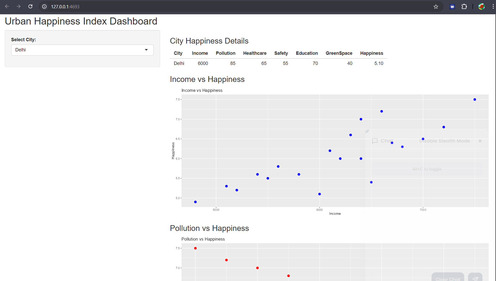

<h1 align="center">🌍 Urban Happiness Index Analysis</h1>

<b>Data Analysis | Visualization | R Programming | Shiny Dashboard</b>

<h2>📌 Project Overview</h2>

This project performs an <b>Urban Happiness Index Analysis</b> using statistical
methods and data visualization techniques in <b>R</b>.

The system analyzes multiple urban indicators such as economic factors,
healthcare, environment, and social support to understand the level of
happiness in different urban regions.

<ul>
<li>📊 Urban happiness data analysis</li>
<li>📉 Correlation analysis between factors</li>
<li>📈 Data visualization using ggplot2</li>
<li>🌐 Interactive dashboard using Shiny</li>
</ul>

<h2>🧠 Analysis Workflow</h2>

<pre>
Urban Happiness Dataset
        ↓
Data Cleaning
        ↓
Exploratory Data Analysis
        ↓
Correlation Analysis
        ↓
Data Visualization
        ↓
Interactive Dashboard
</pre>

<table border="1" cellpadding="8">
<tr>
<th>Parameter</th>
<th>Description</th>
</tr>

<tr>
<td>Language</td>
<td>R Programming</td>
</tr>

<tr>
<td>Visualization</td>
<td>ggplot2</td>
</tr>

<tr>
<td>Dashboard</td>
<td>Shiny</td>
</tr>

<tr>
<td>Data Processing</td>
<td>dplyr</td>
</tr>

</table>

<h2>🛠 Technologies Used</h2>

<ul>
<li>📊 R Programming</li>
<li>📈 ggplot2</li>
<li>📂 dplyr</li>
<li>🔗 corrplot</li>
<li>🌐 Shiny</li>
<li>📉 Statistical Analysis</li>
</ul>

<h2>📂 Project Structure</h2>

<pre>
urban-happiness-analysis
│
├── dataset
│   └── urban_happiness.csv
│
├── analysis
│   └── analysis.R
│
├── dashboard
│   └── app.R
│
├── images
│   └── dashboard.png
│
├── requirements.txt
└── README.md
</pre>

<h2>⚙️ Installation</h2>

<h3>1️⃣ Clone Repository</h3>

<pre>
git clone https://github.com/Yogendra630/urban-happiness-index-analysis.git
</pre>

<h3>2️⃣ Open Project Folder</h3>

<pre>
cd urban-happiness-analysis
</pre>

<h3>3️⃣ Install Required Libraries</h3>

<pre>
install.packages("shiny")
install.packages("ggplot2")
install.packages("dplyr")
install.packages("corrplot")
</pre>

<h2>▶️ Run the Project</h2>

<pre>
Rscript analysis.R
</pre>

To run the dashboard:

<pre>
shiny::runApp("app.R")
</pre>

The system will automatically:

<ul>
<li>Load urban happiness dataset</li>
<li>Perform statistical analysis</li>
<li>Generate visualizations</li>
<li>Launch an interactive dashboard</li>
</ul>

<h2>📊 Data Analysis Pipeline</h2>

<pre>
Load Dataset
        ↓
Data Cleaning
        ↓
Exploratory Data Analysis
        ↓
Correlation Analysis
        ↓
Visualization using ggplot2
        ↓
Interactive Dashboard using Shiny
</pre>

<h2>📈 Example Visualization</h2>

<h2>🔮 Future Improvements</h2>

<ul>
<li>✨ Machine learning prediction models</li>
<li>🌍 Global city datasets integration</li>
<li>📊 Advanced visualization dashboards</li>
<li>☁️ Deploy dashboard online</li>
<li>📱 Web-based analytics platform</li>
</ul>

<h2>🤝 Contributing</h2>

Contributions are welcome!  
Feel free to fork the repository and submit pull requests.

<h2>📜 License</h2>

This project is licensed under the <b>MIT License</b>.

<h2>👨‍💻 Author</h2>

<b>Yogendra Maurya</b> 

⭐ If you like this project, please give it a star on GitHub!

